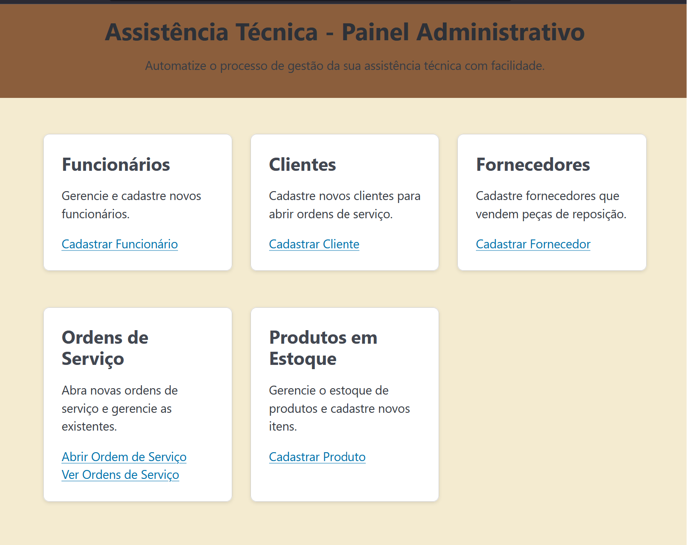
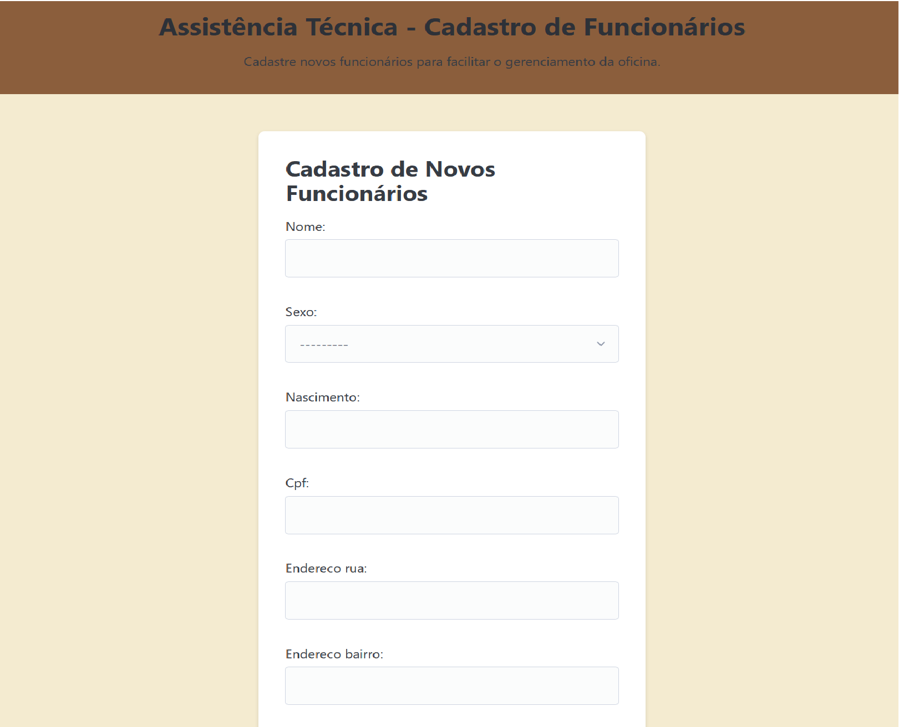
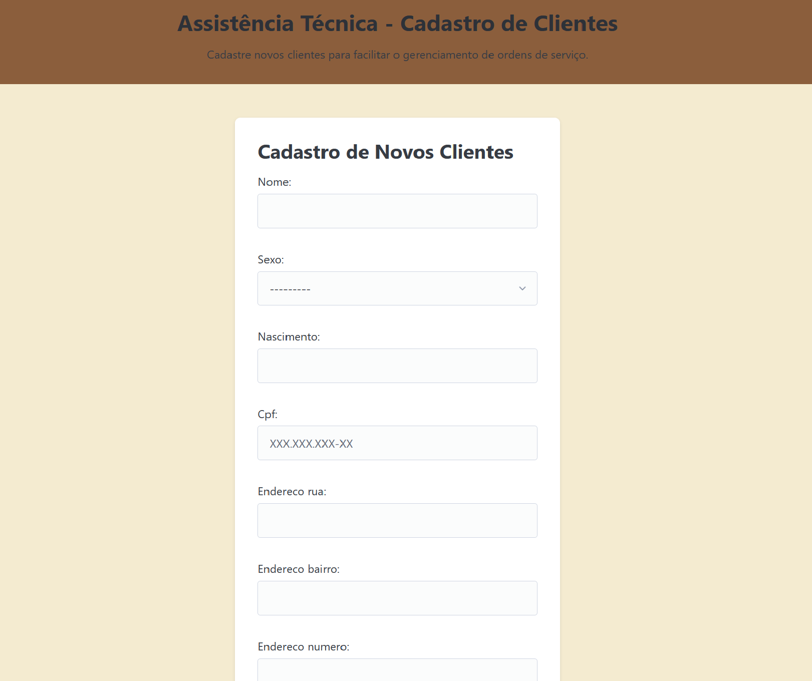
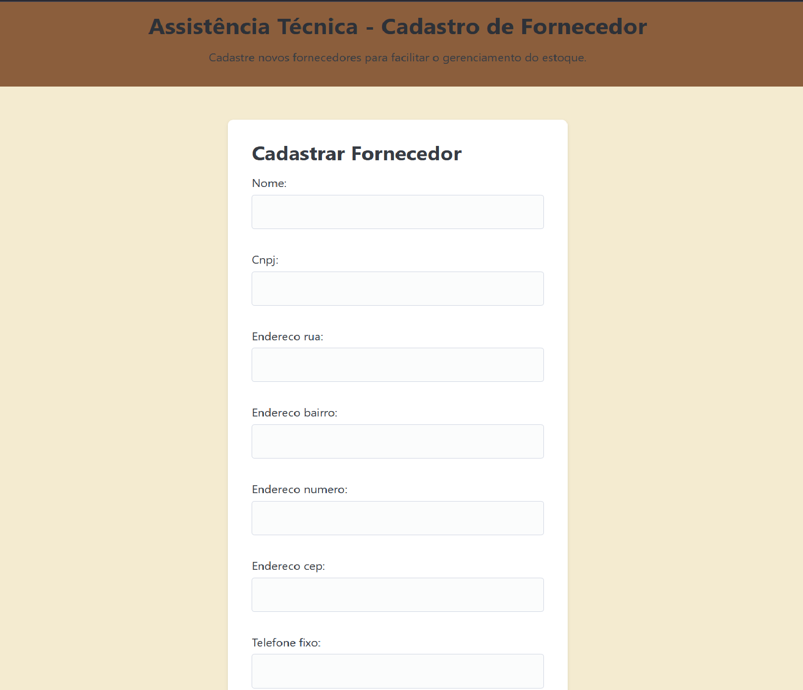
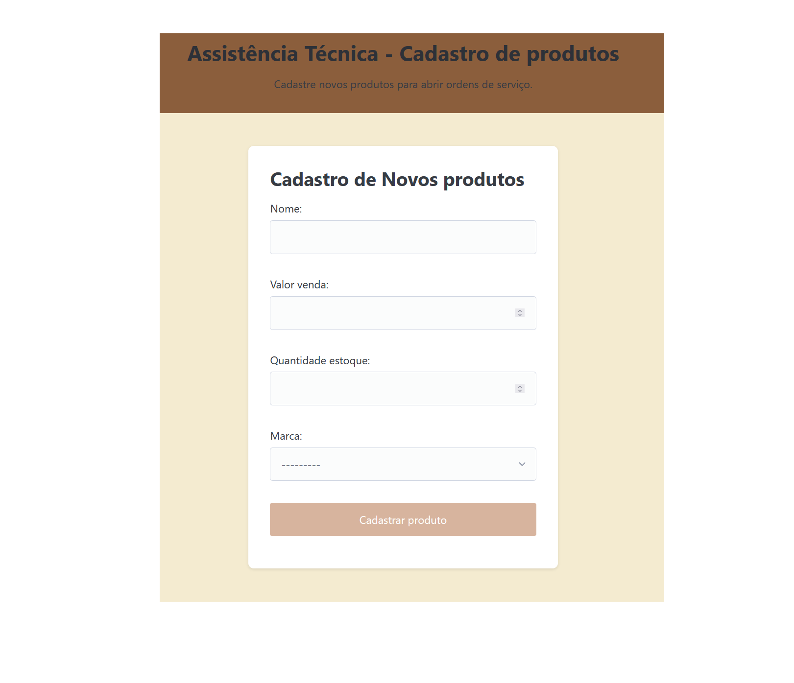

# Controle de Ordem de Serviço

Para o funcionamento do código é necessário, baixar os requirements em um ambiente virtual (venv)

`pip install -r requirements.txt`

Se criado, deve ser atualizado o arquivo my.cnf com as informações do seu banco local.
Também é necessário a criação de um super usuário do django

`python manage.py createsuperuser`

Acesse o endpoint admin/ para cadastrar Marcas, Escolaridade e Cargos. Não foram adicionados "diretamente" no site pois são informações consideradas muito específicas na modelagem.
Após isso o funcionamento deve ocorrer corretamente

`python manage.py runserver`

Foi realizado deploy do site no pythoneverywhere com o link https://theofaino22.pythonanywhere.com/

## ENDPOINTS
- admin/ -> Site administrativo
- fornecedores/ -> lista os fornecedores cadastrados
- fornecedores/novo/ -> formulario de cadastro de fornecedores
- clientes/novo/ -> formulário de cadastro de clientes
- ordem_servico/ -> lista as ordens de serviço abertas
- ordem_servico/novo/ -> formulário de criação de ordens de serviço
- funcionarios/novo/ -> formulário de cadastro de funcionarios
- produtos/novo/ -> formulário de cadastro de produtos

## PAGINAS
### Landing Page

### Funcionarios Page

### Clientes Pages

### Fornecedores Page

### Ordem de Serviços Page

### Produtos Page

